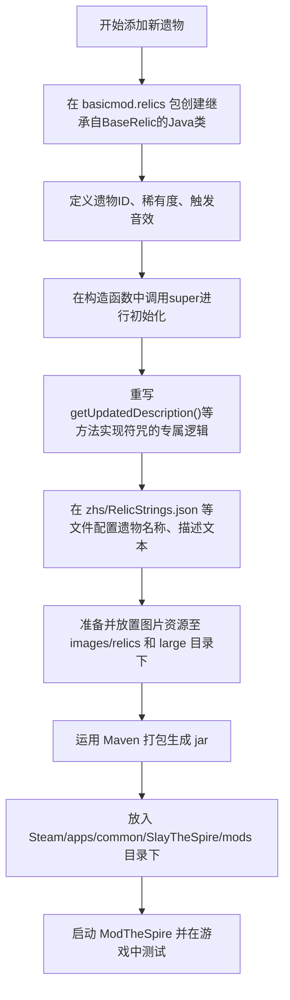

# 杀戮尖塔1 Mod - 添加遗物 技术方案与Todo计划

## 1. 现状分析
当前项目基于 `BasicMod` 模板开发，Mod ID为 `basicmod`。项目内已引入 `BaseMod`、`modthespire`、`StSLib` 等必要的依赖。接下来我们将创建中文包文件夹 `zhs` 并实现12个生肖符咒遗物。

## 2. 添加遗物的逻辑流程

## 3. 具体遗物设计列表（十二生肖符咒）
1. **鼠符咒 (RatTalisman)**: 战斗开始时，手牌中随机一张**状态/诅咒牌**变为随机**攻击牌**。
2. **牛符咒 (OxTalisman)**: 战斗开始时获得 2 点**力量**。你每打出一张攻击牌，造成的伤害额外 +2。
3. **虎符咒 (TigerTalisman)**: 每当**交替**打出【攻击】和【技能】牌时，抽 1 张牌。（无论先攻击后技能，还是先技能后攻击均可触发，每回合限 3 次）
4. **兔符咒 (RabbitTalisman)**: 每回合你打出的**第一张**卡牌不消耗能量。
5. **龙符咒 (DragonTalisman)**: 每当你打出 3 张攻击牌，对所有敌人造成 8 点伤害，如果本回合未触发，计数保留到下一回合。
6. **蛇符咒 (SnakeTalisman)**: 回合结束时，若你未发动攻击获得 1 回合**无实体**。
7. **马符咒 (HorseTalisman)**: 每回合开始移除 1 层负面状态。若战斗结束时未触发移除，**回复 20% 最大生命值**。
8. **羊符咒 (SheepTalisman)**: 对敌方造成负面效果时造成双倍的负面。
9. **猴符咒 (MonkeyTalisman)**: **拾取时：** 选择卡组中 2 张牌进行**变换 (Transform)**。
10. **鸡符咒 (RoosterTalisman)**: 手牌上限 +2，且不再受**纠缠**影响。
11. **狗符咒 (DogTalisman)**: **每局战斗限一次：** 受到致命伤害时，生命值保留在 **20%** 而非死亡。
12. **猪符咒 (PigTalisman)**: 每当你抽到一张牌，对随机敌人造成 3 点伤害。
*注：目前开发阶段，所有遗物的图标均暂时使用代码内置的占位图（如 derpRock.png），并使用默认音效，待十二符咒跑通后统一配置图像资源。*

## 4. 如何发布到杀戮尖塔中测试
老大爷，当代码编写完成后，请遵循以下流程在本地进行发布与测试：

1. **打包（编译成Jar文件）**:
   - 如果您使用 IntelliJ IDEA，打开右侧的 **Maven** 面板，展开 `basicmod` -> `Lifecycle`，双击运行 **`package`** 命令。（或者在命令行执行 `mvn package`）。
2. **移动到游戏目录**:
   - 默认情况下，`pom.xml` 中配置了如果在 Windows 环境下构建，会自动将 `target/basicmod.jar` 复制到您的 Steam 目录如果路径一致 (`C:/Program Files (x86)/steam/steamapps/common/SlayTheSpire/mods/...`)。
   - 如果自动复制失败，请您手动进入本项目的 `target` 目录，找到 `basicmod.jar`。
   - 将其复制到您的杀戮尖塔游戏安装目录的 **`mods`** 文件夹中（例如 `D:\SteamLibrary\steamapps\common\SlayTheSpire\mods`，如果没有 `mods` 文件夹，请自己新建一个）。
3. **启动游戏**:
   - 在 Steam 中运行《杀戮尖塔》时，在弹出的启动选项中选择 **"Play with Mods"**。
   - 此时会打开 **ModTheSpire** 的窗口，您在模组列表中勾选 **`Basic Mod`** （以及前提依赖如 `BaseMod`, `StSLib`），然后点击 **Play** 即可启动进入游戏。
   - 在游戏内随便开一局（或者使用控制台命令如 `relic add basicmod:RatTalisman`）来获取并测试遗物。

## 3. Todo 计划
- [x] 分析 BasicMod wiki 中关于添加遗物的说明 
- [x] 分析当前现有项目结构
- [x] 编写技术方案与 Todo 计划
- [ ] **准备多语言支持环境**
- [x] **获取具体遗物需求（十二符咒设计完毕）**
- [ ] **依次执行遗物开发与逻辑编写**
- [ ] **测试验证与调整**
