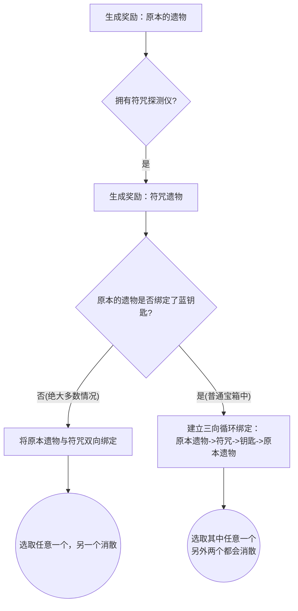

# 符咒探测仪 互斥机制 技术方案

## 1. 需求分析
- **新目标**：老大爷觉得原本直接“增加”一个符咒奖励稍微有些过强。希望修改为“原本的遗物和符咒二选一”的模式。
- **参考示例**：游戏原本的【蓝宝石钥匙】与【原本的遗物】互斥的机制（通过带有链条图标的UI展示，选取其一后另一项消失）。

## 2. 逻辑图

## 3. 技术方案细节
1. **修改 `TalismanLocatorPatch.java`**：
   - 寻找当前奖励列表中的“普通遗物奖励”。
   - 根据随机池生成“符咒奖励”后，插入到普通遗物的正下方。
   - **核心改动：建立 `relicLink`（互斥链接）**。
     - 游戏原生通过 `RewardItem.relicLink` 属性来识别互斥并画出这根“锁链”。
     - 如果只有【原本遗物】和【符咒】，我们直接互相设置 `relicLink`。
     - 如果当前宝箱里有【蓝宝石钥匙】（此时钥匙和原本遗物是互相链接的），我们会把这个“二人转”升级成“三连环”，保证视觉顺序：遗物链向符咒，符咒链向蓝钥匙。
2. **新增奖励领取补丁 `ClaimRewardPatch.java`**：
   - 因为原本游戏的领取逻辑只支持两个物品互斥（它只尝试销毁自己的 `relicLink` 一次）。如果是三者互斥（比如遗物、符咒、蓝宝石钥匙都在），必须打一个额外的补丁。
   - 在任何物品被成功拾取时，代码顺藤摸瓜找遍整个 `relicLink` 的链条并把它们全部置为 `isDone = true`（已消散）。
3. **改掉 `RelicStrings.json` 中的描述**：
   - 将“增加”这个字眼修改为说明有互斥机制的内容，例如：“每次可以选取遗物时，可以#y放弃该遗物，改为获得一个你未拥有的#y随机符咒遗物。”

## 4. 等待确认事项
- **蓝钥匙逻辑**：如果在这个宝箱里同时存在【蓝宝石钥匙】，我目前的方案是“三选一”：也就是说你想要拿到蓝钥匙，就必须放弃【原本的遗物】和【探测出来的符咒】；如果你拿了符咒，也会没掉蓝钥匙。这符合大多数人的直觉，请问老大爷是否同意如此处理？
- 同意的话，请直接下达“准奏”或“开始编码”！
