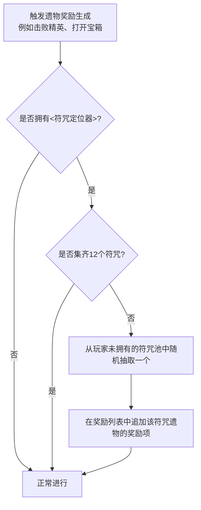

# 符咒定位器 开发计划

## 1. 需求分析
- **新遗物**：符咒定位器 (Talisman Locator)
- **效果**：每次可以选取遗物时，增加一个随机的符咒遗物（该符咒遗物不能是当前已有的）。若集齐12符咒则不增加。
- **涉及修改点**：
  1. 新增遗物类 `TalismanLocator.java`。
  2. 新增补丁类（SpirePatch），用于在遗物奖励生成时（或者奖励界面准备展示时）拦截逻辑，追加符咒奖励。
  3. 修改本地化资源（`RelicStrings.json`），添加名称和描述。
  4. 添加遗物图标（如果目前没有，可能需要临时复用现有图标或等待提供，请确定）。

## 2. 逻辑图

## 3. 技术方案细节
- 获取未拥有的符咒：
  构建包含12种符咒的ID列表（鼠、牛、虎、兔、龙、蛇、马、羊、猴、鸡、狗、猪）。
  遍历玩家背包 `AbstractDungeon.player.relics`，将已拥有的符咒从列表中剔除。
  如果剩余列表为空，则不作处理；如果不为空，使用游戏的随机数生成器（`AbstractDungeon.relicRng`）从中随机选取一个，再实例化为遗物。
- 何时追加奖励：
  采用 ModTheSpire 补丁拦截遗物生成。
  **选项A**：拦截 `AbstractRoom.addRelicToRewards`。大部分战斗掉落或精英/宝箱逻辑是通过此方法添加的。
  **选项B**：拦截 `CombatRewardScreen.setupItemReward`，判断如果有遗物奖励，就根据条件再追加一个符咒奖励。为了防止刷新奖励界面时重复添加，可以在添加生成的 `RewardItem` 时做特殊标记（如判断奖励列表中是否已经包含这12中符咒中的一种）。

## 4. 期待老大爷回复的【等待确认事项】
1. **Boss遗物选择界面**：Boss宝箱（三选一遗物）界面和普通掉落界面不同，是否需要在打败Boss后的三选一面板中增加符咒掉落？如果需要，因为界面只支持固定排版的3个遗物展示，通常做法是直接往玩家背包塞或者特殊处理。一般来说，“可以选取遗物”通常指屏幕右侧弹出的“普通奖励列表（包含了金币、卡牌、遗物）”，建议对普通奖励生效，Boss遗物界面不生效。请问是否同意？
2. **图标准备**：符咒定位器的图标 (`.png` 图片) 是否已经准备好放入 `my_doc` 目录或项目中？如果有指定的图片名字，请告诉我。
3. **技术路线**：上述利用拦截 `CombatRewardScreen` 或 `AbstractRoom` 追加选项的方案是否认可？

请老大爷给出明确的“开始编码”指令或对以上疑惑解答。
