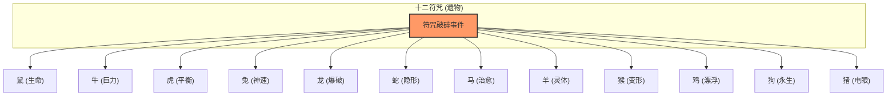

# 十二生肖动物卡牌设计方案

老大爷，针对您想把“符咒破碎，力量寄居于十二只动物”这一情节引入 Mod 的想法，我为您设计了这十二张动物卡牌。

## 设计核心理念

1.  **从“死物”到“活物”**：遗物（符咒）是静止的宝物，而卡牌（动物）是具有生命力的盟友。
2.  **力量的延续与变体**：卡牌效果应与对应的符咒力量呼应，但在玩法上更具互动性。
3.  **稀有性**：作为符咒破碎后的产物，这些卡牌被设定为“金卡（Rare）”或特定的“特殊卡（Special）”。

## 逻辑关系图

---

## 详细卡牌设计

| 动物卡牌 | 符咒对应 | 核心机制设计 | 描述 (参考) |
| :--- | :--- | :--- | :--- |
| **高贵之鼠** | 鼠符咒 | **复苏/生命化** | 将一张本场战斗中被“消耗”的非动物牌置入手中。 |
| **高贵之牛** | 牛符咒 | **极限蛮力** | 造成等同于你当前护甲值的伤害，随后使伤害值翻倍。 |
| **高贵之虎** | 虎符咒 | **阴阳调和** | 如果 护甲 > 生命，获得2点力量；如果 生命 > 护甲，获得2点敏捷。 |
| **高贵之兔** | 兔符咒 | **迅雷之势** | 抽2张牌，接下来的2张攻击牌能量消耗为0。 |
| **高贵之龙** | 龙符咒 | **圣主之怒** | 对所有敌人造成大量伤害，并施加“灼烧”（每回合结束掉血）。 |
| **高贵之蛇** | 蛇符咒 | **虚无之影** | 获得1层“无体”。消耗。 |
| **高贵之马** | 马符咒 | **净化圣疗** | 移除所有负面状态，回复 5 点生命值。 |
| **高贵之羊** | 羊符咒 | **灵体投射** | 选择一张手牌，将一个耗能为 0 的复制品置入抽牌堆顶部。 |
| **高贵之猴** | 猴符咒 | **万千变化** | 将手中一张不需要的牌转化为本场战斗中随机的一张强力金卡。 |
| **高贵之鸡** | 鸡符咒 | **凌空漂浮** | 获得“飞翔”：本回合受到的下一次攻击伤害降低 50%，抽1张牌。 |
| **高贵之狗** | 狗符咒 | **不灭之躯** | 获得1层“护命”：如果在本回合内致死，则保留 10 点生命值。 |
| **高贵之猪** | 猪符咒 | **灼热射线** | 保留。造成贯穿伤害（无视护甲）。 |

---

## 等待用户确认事项

1.  **获取方式**：老大爷，您希望这些动物卡是以什么方式出现在玩家手中？
    -   选项 A：通过特定的“符咒破碎”随机事件，失去符咒遗物，获得对应的动物牌。
    -   选项 B：作为高强度的稀有卡，在商店或战斗后概率掉落。
2.  **卡牌属性**：是否需要为这些动物卡增加一个专属的状态栏图标，或者特定的“动物”标签？
3.  **强度平衡**：目前的数值设计（如马的治疗量、狗的保命次数）只是初步草案，需要后续根据实测调整。

---
老大爷，如果您觉得这套思路可行，请告诉我，我会为您编写具体的技术方案文档！
