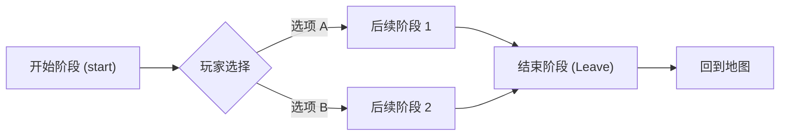

# 杀戮尖塔 (Slay the Spire) 创建事件全指南

老大爷，事件（Event）是让您的 Mod 充满生命力的关键。Wiki 推荐用一种叫 `PhasedEvent` 的结构化写法，这比老式的写法逻辑更清晰，咱们这一篇就专门讲这个。

原文档：https://github.com/Alchyr/BasicMod/wiki/Events

---

## 1. 事件原理：阶段化设计 (PhasedEvent)

以前写事件像是在写乱如麻的判断语句。`PhasedEvent` 就像是编剧本：您把事件分成一个个“阶段”（Phase），每个阶段就是一幕戏。

### 階段轉換邏輯圖


---

## 2. 类结构与基础配置

您的事件类需要继承 `PhasedEvent`。

```java
public class MyEvent extends PhasedEvent {
    public static final String ID = makeID("MyEvent");
    
    // 获取本地化文本（名字、描述、选项）
    private static final EventStrings eventStrings = CardCrawlGame.languagePack.getEventString(ID);
    private static final String NAME = eventStrings.NAME;
    private static final String[] DESCRIPTIONS = eventStrings.DESCRIPTIONS;
    private static final String[] OPTIONS = eventStrings.OPTIONS;
    
    // 事件配图
    private static final String IMG = "images/events/yourImage.jpg";

    public MyEvent() {
        super(ID, NAME, IMG);
        // 这里稍后编写逻辑
    }
}
```

---

## 3. 事件阶段详解 (Registering Phases)

在构造函数里，我们要通过 `registerPhase` 来搭积木。

### 3.1 基础选项示例
```java
registerPhase("start", new TextPhase(DESCRIPTIONS[0])
    .addOption(OPTIONS[0], (i) -> transitionKey("result")) // 简单点击，跳到下一阶段
    .addOption(OPTIONS[1], (i) -> openMap())             // 直接开门送客
);
```

### 3.2 高级选项（带条件判断）
比如玩家金币不够，选项就是灰色的背景且文字变掉：
```java
registerPhase("start", new TextPhase(DESCRIPTIONS[0])
    .addOption(new TextPhase.OptionInfo(OPTIONS[0])
        .enabledCondition(() -> AbstractDungeon.player.gold >= 70, OPTIONS[2]) // 条件不满足显示 OPTIONS[2]
        .setOptionResult((i) -> {
            // 执行逻辑：失去 70 金币，获得随机遗物
            AbstractDungeon.player.loseGold(70);
            AbstractRelic relic = AbstractDungeon.returnRandomScreenlessRelic(AbstractDungeon.returnRandomRelicTier());
            AbstractDungeon.getCurrRoom().spawnRelicAndObtain(this.drawX, this.drawY, relic);
            
            // 选填：记录到运行历史，让 Mod 更高端
            AbstractEvent.logMetricObtainRelicAtCost(ID, "Buy Relic", relic, 70);
            
            transitionKey("success"); // 跳到成功阶段
        })
    )
);
```

---

## 4. 逻辑处理与收尾 (Transitions)

### 4.1 跳转
使用 `transitionKey("key")` 在不同剧情之间横跳。

### 4.2 必须调用的 transitionKey("start")
在构造函数的最后，必须补上一句 `transitionKey("start");`，不然戏台搭好了没主角开场。

### 4.3 结束事件
任何事件的最终剧情阶段，其选项的结果必须是 `(i) -> openMap()`。这代表事件结束，让玩家回到地图界面。

---

## 5. 本地化文本规范 (Strings)

- **路径**: `resources/yourmodID/localization/yourLang/EventStrings.json`
- **格式**:
```json
"${modID}:MyEvent": {
  "NAME": "没礼貌的商人",
  "DESCRIPTIONS": [
    "你想买这块发光的石头吗？",
    "拿走它，赶紧滚。",
    "没钱就别在这耽误我做生意！"
  ],
  "OPTIONS": [
    "[买] #y70 #y金币：获得一个 #g随机遗物。",
    "[没钱] 需要 70 金币。",
    "[离开]"
  ]
}
```
> [!IMPORTANT]
> 代码里的 `DESCRIPTIONS[0]` 对应的就是数组里的第一个字符串。老大爷，数数的时候记得下标是从 0 开始的喔！

---

## 6. 注册与生成 (Registration)

事件写完了，得告诉游戏。在主文件的 `receivePostInitialize` 方法（或者对应的位置）里加这一句：

```java
BaseMod.addEvent(MyEvent.ID, MyEvent.class);
```
如果您想限制它只在第一层（Act 1）出现，或者是特定的条件，可以参考 BaseMod 的高级參數設置。

---

整理完毕。老大爷，事件这块儿有了这份指南，剩下的就看您的创意剧本怎么编了！
