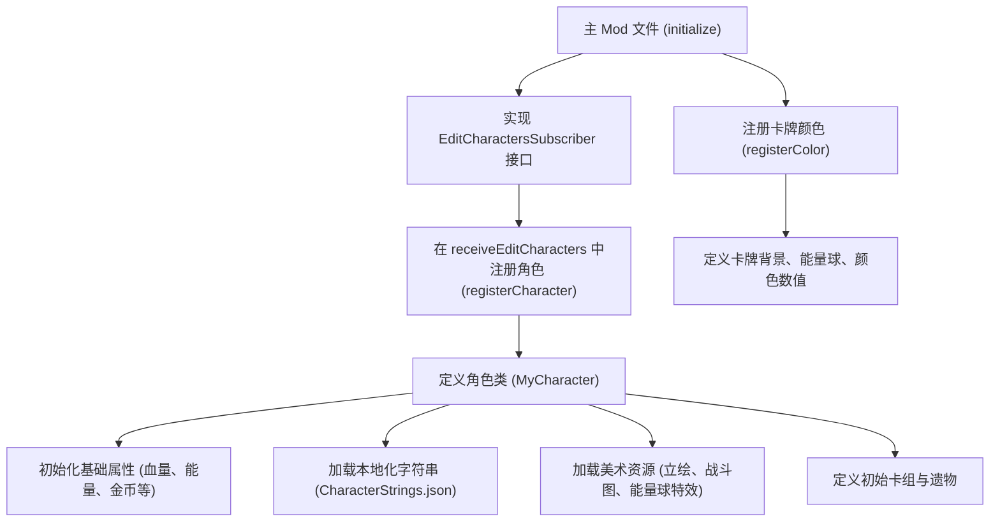

# 杀戮尖塔 (Slay the Spire) 创建角色全指南

老大爷，这份文档详细整理了在杀戮尖塔中添加一个新角色所需的所有事项。从基础的文件结构到复杂的视觉效果，内容涵盖了教程中的每一个细节。

原文档：https://github.com/Alchyr/BasicMod/wiki/Adding-a-Character

> [!TIP]
> **关于遗物**：为了保持文档简洁，遗物相关的详细指南已拆分至 [杀戮尖塔创建遗物.md](file:///d:/code/my/2/fuZhouMod/my_doc/%E6%9D%80%E6%88%AE%E5%B0%96%E5%A1%94%E5%88%9B%E5%BB%BA%E9%81%97%E7%89%A9.md)。

---

## 1. 原理与流程总览

在《杀戮尖塔》中，一个角色不仅仅是一个单一的类，它是由**角色类**、**卡牌颜色定义**、**本地化字符串**以及一系列**美术资源**共同构成的。

### 注册逻辑流程图


---

## 2. 准备工作：美术资源

角色需要大量图像。建议先将占位资源放入以下目录，后续再进行替换：
- **目录：** `resources/yourmodID/images/character`
- **内容包括：**
    - 角色选择界面按钮 (`button.png`) 和立绘 (`portrait.png`)。
    - 战斗内角色图（或动画文件）。
    - 角色专属的卡牌背景（攻击、技能、能力卡及其大图版预览）。
    - 能量球纹理（不同层次的旋转图和特效图）。

---

## 3. 核心步骤：角色类 (Character Class)

这是角色的“灵魂”，负责定义角色的所有属性和行为。

### 3.1 基础配置
在角色类中，首先需要定义角色的基础数值：
- **ENERGY_PER_TURN**: 每回合基础能量 (默认 3)。
- **MAX_HP**: 最大生命值 (如 70)。
- **STARTING_GOLD**: 初始金币 (默认 99)。
- **CARD_DRAW**: 每回合抽牌数 (默认 5)。
- **ORB_SLOTS**: 充能球槽位 (非机器人一般为 0)。

### 3.2 枚举 (Enums) 定义
使用 `@SpireEnum` 来扩展游戏的枚举，这能让游戏识别你的新角色和卡牌颜色。
- `PlayerClass`: 角色职业标识。
- `CardColor`: 卡牌颜色标识。
- `LibraryType`: 图书馆颜色分类（需与 `CardColor` 匹配）。

### 3.3 本地化字符串
在 `CharacterStrings.json` 中定义角色的名称和描述。
- **ID 匹配**：类中的 `ID = makeID("MyID")` 必须对应 JSON 里的 `yourmodID:MyID`。
- **NAMES**：角色在各处显示的名称。
- **TEXT**：角色的背景描述或开场独白。

---

## 4. 注册流程

为了让游戏加载你的角色，必须在主 Mod 文件（如 `BasicMod.java`）中进行操作。

### 4.1 注册卡牌颜色
在主文件的 `initialize()` 方法中调用，定义卡牌分类。
```java
// 示例
MyCharacter.registerColor();
```

### 4.2 注册角色
1. 让主 Mod 类实现 `EditCharactersSubscriber` 接口。
2. 重写 `receiveEditCharacters` 方法：
```java
@Override
public void receiveEditCharacters() {
    // 传入角色类、按钮图像路径、立绘图像路径
    BaseMod.addCharacter(new MyCharacter(), BUTTON_IMG, PORTRAIT_IMG);
}
```

---

## 5. 视觉自定义 (Visuals)

### 5.1 角色动画
- **静态图**：在构造函数中使用 `initializeClass` 指定。
- **Spine/Spriter 动画**：可以调用 BaseMod 提供的动画支持。
- **Hitbox (碰撞箱)**：通过 `initializeClass` 的参数调整角色在屏幕上的位置和大小。

### 5.2 能量球 (Energy Orb)
- **CustomEnergyOrb**：默认支持多层图像叠加旋转，营造动态效果。
    - 图像格式：普通图 128x128，VFX (爆发特效) 图 256x256。
- **自定义类**：如需特殊效果可以实现 `EnergyOrbInterface`。

### 5.3 终局动画 (Heart Kill Cutscene)
重写 `getCutscenePanels()` 方法。
- 返回一个 `CutscenePanel` 列表，每张图代表一个过场瞬间。
- 图片分辨率建议：1920x1200。

---

## 6. 注意事项：避免崩溃 (Anti-Crash)

> [!IMPORTANT]
> **这很重要，老大爷！** 如果卡池不足，测试时会频繁崩溃。

- **最低配置要求**：
    - 普通、罕见、稀有卡各至少 **3 张**。
    - 商店正常运行需要：攻击卡 2 张、技能卡 2 张、能力卡 1 张。
    - 若持有“问号牌”遗物，每种稀有度需要至少 4 张。
- **临时方案**：在开发初期，可以将“棱镜”设为初始遗物，利用其他角色的卡牌来避免因卡池空虚导致的崩溃。

---

## 7. 初始装备设置

- **getStartingDeck()**：返回一个字符串列表，包含初始卡牌的 ID（通常是 5 攻 5 防 + 专属）。
- **getStartingRelic()**：返回一个字符串列表，包含初始遗物的 ID。

---

整理完毕。老大爷，您只要按照这个流程一步步走，新角色就能在塔里横着走了！
