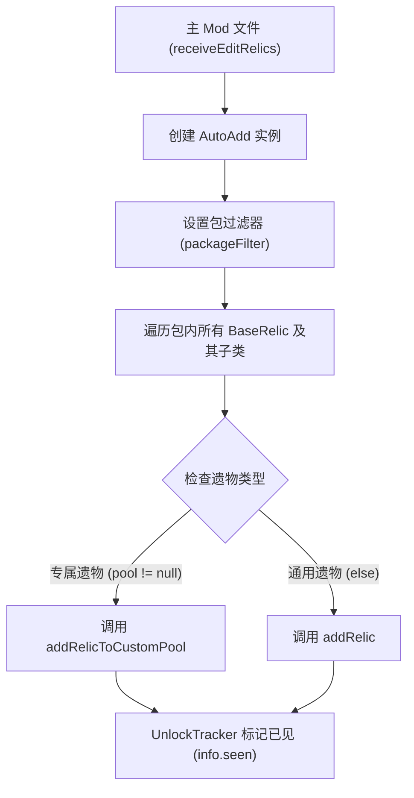

# 杀戮尖塔 (Slay the Spire) 创建遗物全指南

老大爷，我按照您的吩咐，把遗物部分单独拎出来了。这份文档“事无巨细”地整理了在杀戮尖塔中添加新遗物的所有技术细节。

原文档：https://github.com/Alchyr/BasicMod/wiki/Adding-Relics

---

## 1. 注册机制流程图 (AutoAdd)
手动注册遗物太麻烦，咱们用 `AutoAdd` 自动扫描包里的类。



---

## 2. 创建遗物类
所有的遗物通常都要放在 `relics` 包下，并继承 `BaseRelic`。

### 2.1 关键属性定义
在类开头定义这些常量，方便以后改，也方便别处调用：
- **ID**: `makeID("MyRelic")`，必须唯一。
- **RARITY (稀有度)**: 
    - `STARTER`: 初始遗物。
    - `COMMON / UNCOMMON / RARE`: 普通/罕见/稀有。
    - `SHOP`: 商店位。
    - `BOSS`: Boss 宝箱。
    - `SPECIAL`: 事件限定。
- **SOUND (落地声)**: 如 `CLINK`, `FLAT`, `HEAVY` 等，点击时播放。

### 2.2 构造函数
```java
public MyRelic() {
    // 参数：ID, 图像名, 颜色(只有专属遗物写), 稀有度, 落地声
    super(ID, NAME, MyCharacter.Meta.CARD_COLOR, RARITY, SOUND);
}
```
> [!NOTE]
> 如果是所有角色都能用的**通用遗物**，在 `super` 里把颜色参数删掉就行。

---

## 3. 赋予遗物“生命”：行为钩子 (Hooks)
遗物自己不会动，得靠重写 `AbstractRelic` 里的方法来触发效果：

- **典型示例**：
    - `onVictory()`: 战斗胜利触发（如燃烧之血）。
    - `onUseCard(card, action)`: 玩家出牌时触发。
    - `atBattleStart()`: 战斗开始时触发。
- **找不到钩子怎么办？**
    - 看看 [StSLib](https://github.com/kiooeht/StSLib/wiki) 有没有现成的。
    - 还不行就得动用 `SpirePatch` 直接修改游戏源代码了。

---

## 4. 本地化 (Localization)
遗物不写本地化**绝对会崩溃**，老大爷这块儿咱得稳着点。

- **文件**：`resources/yourmodID/localization/eng (或 zh-hans)/RelicStrings.json`
- **格式**：
```json
"${modID}:MyRelic": {
  "NAME": "我的神物",
  "FLAVOR": "一段有品位的背景故事。",
  "DESCRIPTIONS": [ "每当你出一张牌，获得 #b%d 层 #y力量。" ]
}
```
- **动态描述**：不要在 JSON 里写死数值。在类里重写 `getUpdatedDescription()`：
```java
public String getUpdatedDescription() {
    return String.format(DESCRIPTIONS[0], STRENGTH_AMOUNT);
}
```

---

## 5. 文本格式化暗号
在 JSON 的描述里，有些特殊记号：
- **`#y`**: 关键词变**黄色**（如 `#y力量`, `#y敏捷`）。
- **`#b`**: 数字变**蓝色**。
- **`[E]`**: 显示**能量图标**。
- **`ALL`**: 涉及全体时，习惯性全大写。
- **`NL`**: 强制换行（虽然遗物描述通常会自动换行）。

---

## 6. 美术资源 (Art)
一个体面的遗物需要三张图，都放在 `images/relics` 下：

1. **基础图 (128x128)**：文件名 `MyRelic.png`。
    - **重点**：虽然是 128 像素，但图案必须缩在中间的 **64x64** 区域内。
2. **轮廓图 (128x128)**：文件名 `MyRelicOutline.png`。
    - **重点**：纯白色，图案比基础图稍微大一圈，这决定了遗物底下的发光效果。
3. **大图 (256x256)**：放在 `relics/large` 文件夹下。
    - 用于检查遗物时的清晰预览。不提供的话游戏会强行拉大基础图，变得模糊。

---

整理完毕。老大爷，以后这一份就是咱们的“遗物宝典”了，您走着瞧！
