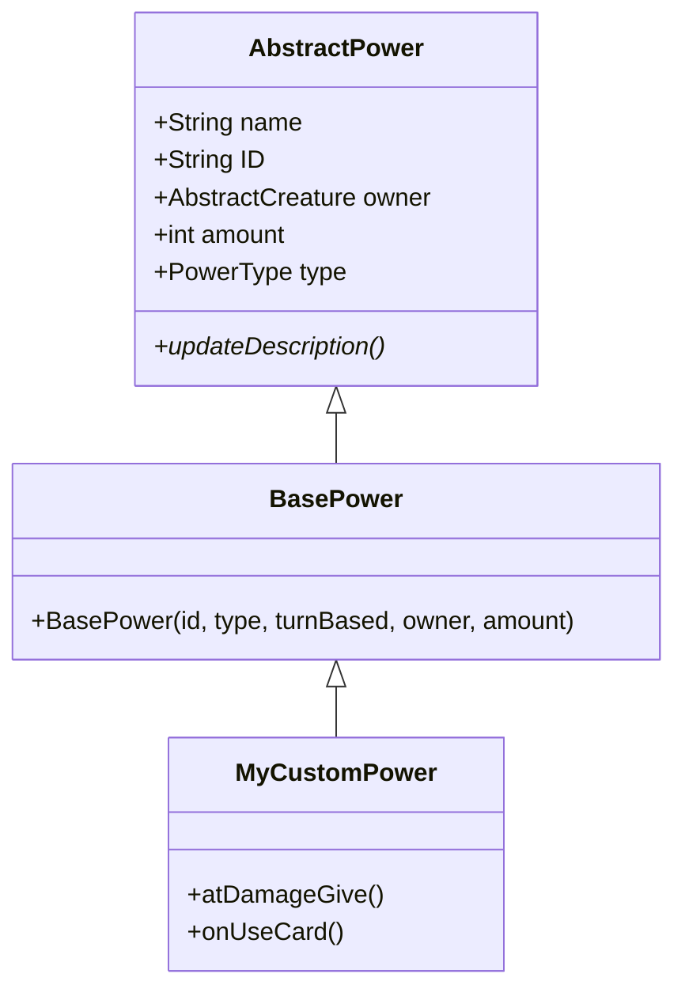

# 杀戮尖塔：编写能力（Powers - Buff/Debuff）指南

在《杀戮尖塔》中，“能力”（Power）是所有作用于玩家或敌人的 BUFF（增益）和 DEBUFF（减益）的总称。
注意：不要将“能力”与“能力牌”（Power Cards）混淆，能力牌通常是用来给实体（玩家或敌人）施加“能力”的手段。

原文档：https://github.com/Alchyr/BasicMod/wiki/Powers-(Buffs)

---

## 1. 基础概念

所有的能力都继承自 `AbstractPower` 类。在 `BasicMod` 模板中，建议继承 `BasePower` 类，它继承自 `AbstractPower` 并提供了一些额外的工具方法，使设置过程更加简便。

### 核心类关系


---

## 2. 编写一个能力类

下面是一个简单的能力实现示例（类似于“力量”的效果）：

```java
public class NotStrengthPower extends BasePower {
    // 能力的唯一 ID
    public static final String POWER_ID = makeID("NotStrength");
    
    // 能力类型：BUFF（增益）或 DEBUFF（减益）
    private static final AbstractPower.PowerType TYPE = AbstractPower.PowerType.BUFF;
    
    // 是否为“回合型”能力
    // 注意：这个参数仅控制图标上数字的颜色。
    // 回合型（Turn Based）为白色，非回合型则根据数值的正负显示为红色或绿色。
    private static final boolean TURN_BASED = false;

    public NotStrengthPower(AbstractCreature owner, int amount) {
        super(POWER_ID, TYPE, TURN_BASED, owner, amount);
    }

    // 钩子函数：攻击时修改伤害
    @Override
    public float atDamageGive(float damage, DamageInfo.DamageType type) {
        // 如果是普通攻击伤害（NORMAL），则增加该能力的层数作为额外伤
        return type == DamageInfo.DamageType.NORMAL ? damage + this.amount : damage;
    }

    // 更新文本描述（从本地化文件中获取）
    @Override
    public void updateDescription() {
        // DESCRIPTIONS 数组在 BasePower 中自动加载自 PowerStrings.json
        this.description = DESCRIPTIONS[0] + amount + DESCRIPTIONS[1];
    }
}
```

---

## 3. 文本与本地化 (Localization)

能力的名称和描述存储在 `PowerStrings.json` 文件中。

### 配置文件路径
`src/main/resources/basicmod/localization/zhs/PowerStrings.json`

### JSON 格式示例
```json
{
  "${modID}:NotStrength": {
    "NAME": "不是力量",
    "DESCRIPTIONS": [
      "攻击造成额外的 #b", 
      " 点伤害。"
    ]
  }
}
```

### 文本格式化技巧
- **#b**: 后接的内容将显示为 **蓝色** (通常用于数字)。
- **#y**: 后接的内容将显示为 **黄色** (通常用于关键字)。
- **DESCRIPTIONS 数组**:
    - `DESCRIPTIONS[0]` = "攻击造成额外的 #b"
    - `DESCRIPTIONS[1]` = " 点伤害。"
    - 代码中连接方式：`DESCRIPTIONS[0] + amount + DESCRIPTIONS[1]`

---

## 4. 图标 (Icons)

`BasePower` 会自动从 `resources/modid/images/powers` 文件夹加载图像。

### 图片命名规范
假设能力 ID 为 `NotStrength`：
1. **小图标 (32x32)**: `resources/modid/images/powers/NotStrength.png`
   - 用于在角色下方显示的状态栏图标。
   - 建议内部绘图区域约为 28x28，留出少量透明边缘。
2. **大图标 (84x84)**: `resources/modid/images/powers/large/NotStrength.png` (可选)
   - 用于施加能力时的闪烁特效。
   - 如果不提供，系统会拉伸小图标（可能会产生像素感）。

---

## 5. 施加能力 (ApplyPowerAction)

无论能力是增益还是减益，无论是施加给玩家还是敌人，统一使用 `ApplyPowerAction`。

### 常用构造函数
```java
public ApplyPowerAction(AbstractCreature target, AbstractCreature source, AbstractPower powerToApply)
```
- **target**: 目标（如玩家 `p` 或怪物 `m`）。
- **source**: 来源（通常是玩家 `p`）。
- **powerToApply**: 要施加的能力实例。**注意**：能力的 `owner` 必须与 `target` 一致。

### 使用示例（在卡牌的 `use` 方法中）
```java
// 获得 !M! 层“不是力量”能力
@Override
public void use(AbstractPlayer p, AbstractMonster m) {
    addToBot(new ApplyPowerAction(p, p, new NotStrengthPower(p, magicNumber)));
}
```

### 进阶参数
1. **stackAmount**: 
   - 如果目标已有该能力，则原有层数增加 `stackAmount`。
   - 如果不传此参数，默认使用 `powerToApply.amount`。
   - 如果是不堆叠的能力（如“壁垒”），可以设置为 0 或 -1。
2. **isFast (boolean)**: 
   - 设置为 `true` 可以加快动作速度，适用于同时给多个敌人施加大量能力时。
3. **effect (AttackEffect)**: 
   - 施加能力时的视觉/音效。

---

## 6. 其他重要提示

- **层数递减**: `AbstractPower` 本身不会自动让层数在每回合结束时减少。如果需要此功能，通常需要在能力类中重写特定的事件方法（如 `atEndOfRound` 或 `onAfterUseCard`），并手动减少层数并调用 `addToBot(new ReducePowerAction(...))` 或 `addToBot(new RemoveSpecificPowerAction(...))`。
- **获取/检查能力**: 建议使用 `POWER_ID` 字段进行检查，避免硬编码字符串。
  - 示例：`if (AbstractDungeon.player.hasPower(NotStrengthPower.POWER_ID)) { ... }`
- **层数显示**: 默认情况下，如果 `amount` 为负数，图标上不会显示数字。如果想显示负数，请在构造函数中设置 `canGoNegative = true`。
