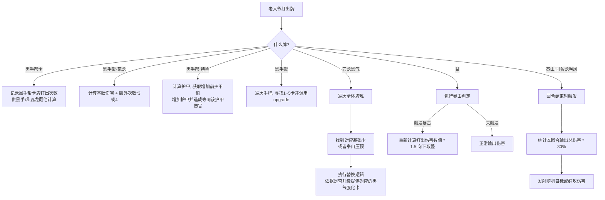

# 黑手帮 & 黑气卡 实现计划

## 1. 计划概述
本计划旨在实现 13 张“黑手帮”与“黑气”相关卡牌。遵循大爷的指令，包括新建基础卡、重做现有卡，以及增加黑气转变逻辑。

## 2. 需求确认总结
1. **甘、文、崔的对应关系：** 周 -> 甘；拉苏 -> 文；阿奋 -> 崔。
2. **重复的卡牌描述：** 已经删除重复的第 11 项，总计 13 张卡。
3. **刀龙黑气转变逻辑：** 全局替换（手牌、抽牌堆、弃牌堆），且基础卡若已升级则替换为升级后的黑气卡。
4. **原有的【瓦龙】与卡图问题：** 原本的瓦龙改成【金鸡鸡王的宝藏】，新版的【黑手帮·瓦龙】使用原版瓦龙的图片。
5. **甘的暴击伤害逻辑：** 确认按计算基础与力量加成后的总伤害，乘 1.5 向下取整。单场战斗打出次数记录在内存中用于增加暴击率。

## 3. 卡牌实现列表 (Todo)

### 黑手帮系列（新建与修改）
- [ ] 1. **黑手帮·阿奋** (白卡/打击) - 1费，打 6(9)
- [ ] 2. **黑手帮·周** (白卡/技能) - 1费，得 5(8) 甲
- [ ] 3. **黑手帮·拉苏** (白卡/技能) - 1费，得 3(5) 甲，抽1丢1 (升：抽2丢2)
- [ ] 4. **黑手帮·瓦龙** (蓝卡/打击) - 2费，打 12(15)，本回合每打一张黑手帮卡额外打 3(4) 
- [ ] 5. **黑手帮·特鲁** (金卡/打击叠盾) - 覆盖现有特鲁。2费，打 8(10) 得 8(10) 甲，额外造成原本护甲值伤害。
- [ ] 6. **黑手帮** (蓝卡/技能/消耗) - 1费(升0费)，升级手牌中上述1~5的卡牌。

### 黑气强化系列与相关卡牌
- [ ] 7. **泰山压顶** (蓝卡/能力) - 重做。2费(升1费)，回合结束对随机敌人造成本回合累计输出伤害的30%。
- [ ] 8. **甘** (金卡/打击) - 1费，打 8(12)，暴击率初始 10%(升20%)，单次战斗每次使用暴击率+10%。暴击时总伤害 x1.5。
- [ ] 9. **文** (金卡/技能) - 1费，得 8(11) 甲，本回合受击反弹 3(5) 点伤害。
- [ ] 10. **崔** (金卡/技能) - 1费，得 6(8) 甲，抽 1(2) 丢 1(2)，给予敌人 1(2) 层虚弱。
- [ ] 11. **龙卷风摧毁停车场** (金卡/能力) - 重做。2费(升1费)，回合结束对全体敌人造成本回合累计输出伤害的30%。
- [ ] 12. **刀龙黑气** (金卡/技能/消耗) - 2费，转变牌堆/手中：周->甘，拉苏->文，阿奋->崔，泰山压顶->龙卷风。升级版转变对应升级版卡牌。
- [ ] 13. **金鸡王的宝藏** (金卡/技能) - 【瓦龙】重做。2费(升1费)，本回合黑手帮、阿福系列卡牌变为 0 费。（暂名金鸡王的宝藏，用新卡图）。

## 4. 逻辑架构图

## 5. 预期执行步骤
1. [已完成] 确认需求中的待确认事项，并修正逻辑图等资源配置。
2. 将依次生成/修改上述 13 张卡的 Java 逻辑。
3. 把卡牌注册到 `BasicMod.java` （根据 `AutoAdd` 规则可以自行扫描）。
4. 在 `CardStrings.json` 增加这 13 张卡的文本资源。
5. 等待后续老大爷您放入对应的图片资源即可。
